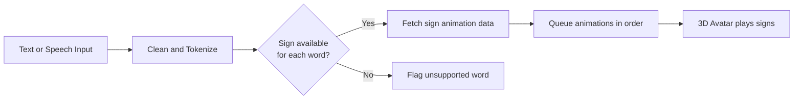

<div align="center">

# ISL Avatar Extension

### Turn text and speech into Indian Sign Language, right inside your browser.

<!-- EDIT: replace with a real GIF or screenshot of the extension in action (about 800px wide) -->


<br/>


[Features](#features) &nbsp;|&nbsp; [Quick Start](#quick-start) &nbsp;|&nbsp; [How It Works](#how-it-works) &nbsp;|&nbsp; [Roadmap](#roadmap) &nbsp;|&nbsp; [Contributing](#contributing)

</div>

---

> [!NOTE]
> **Why this exists:** Millions of Deaf and hard-of-hearing people in India use Indian Sign Language (ISL) as their primary language, yet most web content is only available as written text. This extension brings a 3D signing avatar to any web page so content becomes accessible without leaving the page.

> [!IMPORTANT]
> **Scope:** This is a phrase-to-sign lookup and animation tool, not a full linguistic translation system. Signed output is built from a vocabulary of known signs.
> <!-- EDIT: adjust to match what your project really does and any validation by ISL signers -->

---

## Table of Contents

- [Features](#features)
- [Demo](#demo)
- [Quick Start](#quick-start)
- [How It Works](#how-it-works)
- [Project Structure](#project-structure)
- [Tech Stack](#tech-stack)
- [Roadmap](#roadmap)
- [FAQ](#faq)
- [Contributing](#contributing)
- [License](#license)
- [Acknowledgements](#acknowledgements)

---

## Features

| Symbol | Feature | Description |
|:---:|---|---|
| &#9998; | **Select and Sign** | Highlight any text on a page and watch the avatar sign it |
| &#9202; | **Speech Input** | Speak a sentence and get it signed in real time |
| &#9673; | **3D Avatar** | Smooth, lightweight avatar rendered in the browser |
| &#9201; | **Speed Control** | Slow down or speed up signing to match the learner |
| &#8635; | **Replay and Loop** | Re-watch any sign as many times as needed |
| &#10003; | **No Wrong Signs** | Words without a validated sign are flagged instead of guessed |

<!-- EDIT: keep only the features that are true for your project -->

<details>
<summary><b> Planned and experimental features</b></summary>

<br/>

- &#9702; Learning mode with flashcards for common ISL signs
- &#9702; Export signed phrases as short video clips
- &#9702; Support for regional sign variations
- &#9702; Avatar customization (skin tone, clothing, background)

</details>

---

## Demo

<!-- EDIT: add your real links -->

| Live Demo | Video Walkthrough | Slides |
|:---:|:---:|:---:|
| [Try it &rarr;](#) | [Watch &rarr;](#) | [View &rarr;](#) |

<details>
<summary><b> Screenshots</b></summary>

<br/>

| Popup | In-page overlay | Settings |
|:---:|:---:|:---:|
|  |  |  |

</details>

---

## Quick Start

### Install from source (Chrome / Edge)

```bash
# 1. Clone the repository
git clone https://github.com/aryadhumne/isl-avatar-extension.git
cd isl-avatar-extension

# 2. Install dependencies (if the project uses a build step)
npm install

# 3. Build the extension
npm run build
```

Then load it into your browser:

1. Open `chrome://extensions` (or `edge://extensions`)
2. Turn on **Developer mode** (top right)
3. Click **Load unpacked**
4. Select the project's build folder (for example `dist/`, or the repo root)
5. Pin the extension icon to your toolbar

> [!TIP]
> After installing or updating the extension, reload any open tabs so the content script is injected.

<details>
<summary><b>&#9656; Troubleshooting</b></summary>

<br/>

| Problem | Fix |
|---|---|
| Avatar does not appear | Reload the page after installing the extension |
| Microphone not working | Allow microphone access for the extension in browser settings |
| Extension will not load | Make sure you selected the folder containing `manifest.json` |
| Signs look choppy | Close heavy tabs; the avatar uses your GPU |

</details>

---

## How It Works



**In plain words**

1. **Input:** you select text on a page or speak into the microphone.
2. **Processing:** the sentence is cleaned and split into words and phrases.
3. **Lookup:** each word is matched against a library of signs.
4. **Animation:** matched signs are played back by the avatar one after another.

<details>
<summary><b> Deeper technical notes</b></summary>

<br/>

- **Content script** captures selected text and injects the avatar overlay into the page.
- **Background / service worker** coordinates messaging between the popup, the page and speech input.
- **Sign data** is stored as pose or animation sequences that the avatar reads frame by frame.
- **Lookup** uses a dictionary-style index so each word resolves to a sign quickly.

<!-- EDIT: replace with the actual architecture of your project -->

</details>

---

## Project Structure

<!-- EDIT: update to match your real folders -->

```text
isl-avatar-extension/
|-- manifest.json        # Extension configuration
|-- src/
|   |-- background/      # Service worker
|   |-- content/         # Page-injected scripts and avatar overlay
|   |-- popup/           # Extension popup UI
|   `-- avatar/          # 3D avatar and animation player
|-- data/                # Sign vocabulary and animation data
|-- docs/                # Screenshots, GIFs, diagrams
`-- README.md
```

---

## Tech Stack

<!-- EDIT: keep only what you actually use -->


---

## Roadmap

- [x] Project setup and extension skeleton
- [ ] Text selection to sign playback
- [ ] Speech-to-sign input
- [ ] Larger sign vocabulary
- [ ] Speed and replay controls
- [ ] Learning mode
- [ ] Validation of signs with ISL signers and Deaf community feedback
- [ ] Publish to the Chrome Web Store

> [!TIP]
> Have an idea? [Open a feature request](../../issues/new).

---

## FAQ

<details>
<summary><b> Is this a full ISL translator?</b></summary>

<br/>

No. ISL has its own grammar and structure, which differs from English word order. This tool maps words and phrases to known signs; it does not claim to replace human interpreters.

</details>

<details>
<summary><b> What if a word has no sign?</b></summary>

<br/>

The extension flags it rather than showing an unrelated sign, so users are never misled.

</details>

<details>
<summary><b> Does it send my text anywhere?</b></summary>

<br/>

<!-- EDIT: state the truth for your implementation -->
Describe here whether processing happens locally in the browser or through an external service.

</details>

<details>
<summary><b> Which browsers are supported?</b></summary>

<br/>

Chromium-based browsers (Chrome, Edge, Brave). Firefox support is not yet available.
<!-- EDIT -->

</details>

---

## Contributing

Contributions are very welcome, especially from **ISL users, signers and interpreters** who can help check sign accuracy.

1. Fork the repository
2. Create a branch: `git checkout -b feature/my-feature`
3. Commit your changes: `git commit -m "Add my feature"`
4. Push the branch: `git push origin feature/my-feature`
5. Open a Pull Request

---

<!--## License

<!-- EDIT: confirm the license and add a LICENSE file -->
Distributed under the MIT License. See `LICENSE` for details.

---
-->
## Acknowledgements

<!-- EDIT: credit datasets, libraries, mentors, teammates 
- ISL community members and signers who guide accuracy -->
- Open-source libraries powering the avatar and the extension
- Teammates and mentors

---

<div align="center">

**Built for accessibility**

Star this repository if you find it useful.

</div>
